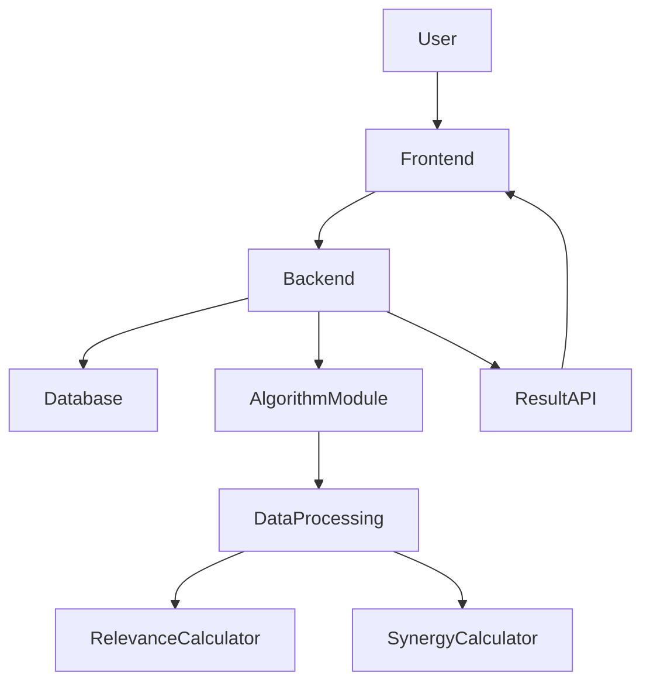
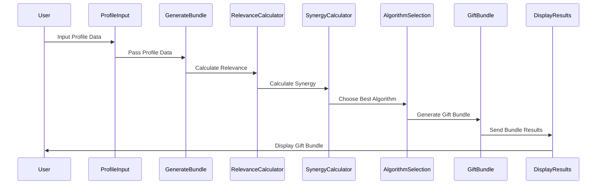
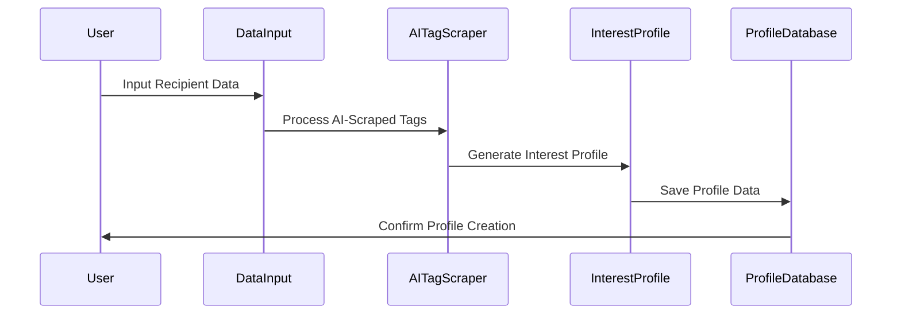
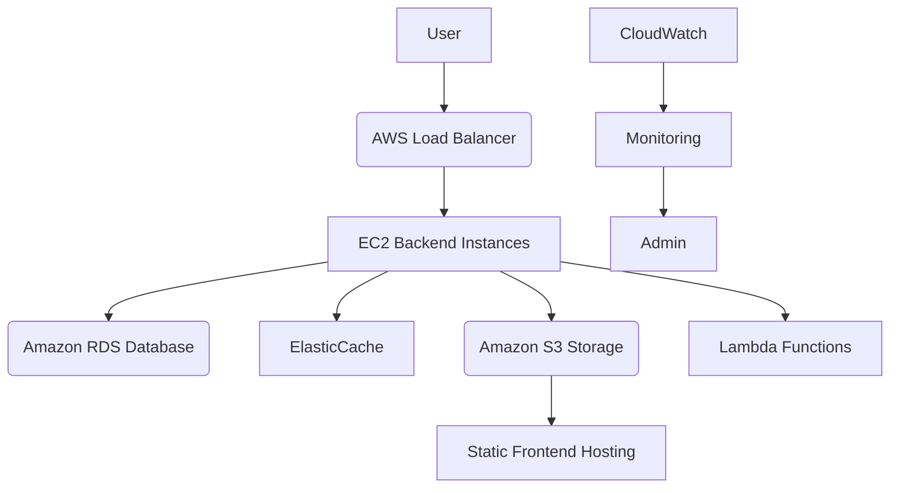

# GiftGenius

**GiftGenius** is an intelligent gift bundling system that leverages a hybrid combination of algorithms—**Greedy**, **Genetic Algorithm**, and **Simulated Annealing**—to create personalized gift bundles. By assessing each recipient's preferences, interests, and budget constraints, GiftGenius aims to provide the most satisfying gift sets while maximizing relevance and synergy.

**GitHub Repository**: [0x11a0/giftgenius](https://github.com/0x11a0/giftgenius)

---

## Table of Contents

1. [Overview](#overview)
2. [General Architecture](#general-architecture)
3. [Hybrid Algorithms](#hybrid-algorithms-greedy--genetics--simulated-annealing)
4. [Data Structure](#data-structure)
5. [Method to Derive Product Relevance for Recipient](#method-to-derive-product-relevance-for-recipient)
6. [Method to Derive Weight of Product Synergy](#method-to-derive-weight-of-product-synergy)
7. [Method to Generate Interest Tags for Recipient Profile](#method-to-generate-interest-tags-for-recipient-profile)
8. [Flow Diagram for User to Generate Gift Bundle](#flow-diagram-for-user-to-generate-gift-bundle)
9. [Flow Diagram for User to Generate Recipient Profile](#flow-diagram-for-user-to-generate-recipient-profile)
10. [Business Case: How GiftGenius Can Be Utilized by eCommerce Platforms](#business-case)
11. [Design Principles Applied: SOLID](#design-principles-applied--solid)
12. [Design Principles Applied: Gang of Four](#design-principles-applied-gang-of-four)
13. [Scaling Strategy: Cloud Architecture on AWS](#scaling-strategy-cloud-architecture-on-aws)
14. [Project Setup Guide](#project-setup-guide)
15. [Docker Setup Guide](#docker-setup-guide)
16. [Contribution](#contribution)
17. [License](#license)

---

### 1. Overview

GiftGenius is an AI-driven gift bundling engine designed to select the best combination of products for any recipient. The system uses multiple hybrid algorithms and AI-derived interest tags to calculate **base satisfaction**, **personalized satisfaction**, **relevance**, and **synergy** between products, delivering curated gift bundles that maximize user satisfaction within a specified budget.

### 2. General Architecture

GiftGenius is structured to separate the backend processing (product selection and algorithm computation) from the frontend, which provides an interface for users to create profiles and generate personalized gift bundles.



### 3. Hybrid Algorithms (Greedy + Genetics + Simulated Annealing)

GiftGenius combines three algorithms:
- **Greedy Algorithm**: Quickly approximates an initial gift bundle based on the best “value per dollar.”
- **Genetic Algorithm**: Evolves the initial solution to optimize overall satisfaction, relevance, and synergy.
- **Simulated Annealing**: Fine-tunes the final selection, escaping local optima by exploring alternative bundles.

### 4. Data Structure

GiftGenius uses structured data classes to represent each product, recipient, and profile. The data structure for each product includes a **base satisfaction** value and methods for calculating **personalized satisfaction**.

```python
class Product:
    def __init__(self, name, category, price, base_satisfaction, tags, synergy_items):
        self.name = name
        self.category = category
        self.price = price
        self.base_satisfaction = base_satisfaction
        self.tags = tags
        self.synergy_items = synergy_items

    def calculate_personalized_satisfaction(self, relevance_points):
        """Calculates personalized satisfaction based on relevance to a recipient."""
        return self.base_satisfaction + relevance_points
```

### 5. Method to Derive Product Relevance for Recipient

The `calculate_relevance_points()` function calculates relevance based on the number and type of matching tags between the user profile and product tags. Relevance points are then added to the **base satisfaction** to calculate **personalized satisfaction** for the recipient.

### 6. Method to Derive Weight of Product Synergy

Synergy is calculated by matching product pairs with complementary functionalities. Each matching synergy item boosts satisfaction by a fixed synergy point value, enhancing **personalized satisfaction** when bundled with compatible products.

### 7. Method to Generate Interest Tags for Recipient Profile

AI scrapes data sources related to the recipient, generating tags based on behavioral patterns, past purchases, or indicated interests (e.g., “Fitness Enthusiast,” “Tech Lover”).

### 8. Flow Diagram for User to Generate Gift Bundle



### 9. Flow Diagram for User to Generate Recipient Profile



### 10. Business Case: How GiftGenius Can Be Utilized by eCommerce Platforms

**GiftGenius** provides a unique advantage for eCommerce platforms by enabling a **personalized gift shopping experience**:
- **Enhanced Recommendations**: eCommerce platforms can integrate GiftGenius to offer curated gift sets based on the customer’s profile, increasing engagement and average order value.
- **User Retention**: Personalization through GiftGenius increases user retention by offering highly relevant product recommendations.

### 11. Design Principles Applied: SOLID

GiftGenius follows SOLID principles:
- **Single Responsibility**: Each class and function has a single, well-defined purpose.
- **Open/Closed Principle**: New algorithms or data sources can be added without modifying existing classes.
- **Liskov Substitution**: Interchangeable components (e.g., algorithms) are designed to be substitutable without altering functionality.
- **Interface Segregation**: Separate interfaces for different functionalities.
- **Dependency Inversion**: High-level modules are isolated from low-level implementation details.

### 12. Design Principles Applied: Gang of Four

GiftGenius uses several **Gang of Four** design patterns:
- **Strategy Pattern**: Allows the system to select the optimal algorithm (Greedy, Genetic, Simulated Annealing) at runtime.
- **Factory Pattern**: Creates objects such as products, profiles, and algorithms based on configuration.
- **Observer Pattern**: Notifies user interface components when a new recommendation is ready.

### 13. Scaling Strategy: Cloud Architecture on AWS

GiftGenius is designed for cloud deployment, utilizing AWS for scalability and high availability.



### 14. Project Setup Guide

1. **Clone the Repository**:
   ```bash
   git clone https://github.com/0x11a0/giftgenius.git
   cd giftgenius
   ```

2. **Install Requirements**:
   ```bash
   pip install -r requirements.txt
   ```

3. **Run the Application**:
   ```bash
   python app.py
   ```

### 15. Docker Setup Guide

1. **Build Docker Image**:
   ```bash
   docker build -t giftgenius .
   ```

2. **Run Docker Container**:
   ```bash
   docker run -d -p 8000:8000 giftgenius
   ```

### 16. Contribution

Contributions are welcome! Please submit pull requests, report issues, and contribute to feature development.

### 17. Project Tree
```
giftgenius/
├── README.md
├── LICENSE
├── requirements.txt
├── .gitignore
├── data/
│   ├── products.json                   # Product catalog with details like tags, base satisfaction, etc.
│   └── profiles.json                   # Sample recipient profiles for testing
├── docs/
│   ├── ALGORITHMS.md                   # Documentation detailing the Greedy, Genetic, and Simulated Annealing algorithms used for gift bundling
│   ├── MEMOIZATION.md                  # Explanation of memoization techniques used to improve performance by caching intermediate results. 
│   └── WHAT-HAPPENS-WHEN.md            # Step-by-step documentation on the end-to-end process from user input to final bundle generation.
├── src/
│   ├── __init__.py
│   ├── app.py                          # Main entry point for the application
│   ├── config.py                       # Configuration settings (e.g., database URI, API keys)
│   ├── algorithms/
│   │   ├── __init__.py
│   │   ├── greedy.py                   # Greedy Algorithm for initial bundle generation
│   │   ├── genetic.py                  # Genetic Algorithm for bundle refinement
│   │   └── simulated_annealing.py      # Simulated Annealing for final optimization
│   ├── core/
│   │   ├── __init__.py
│   │   ├── models/
│   │   │   ├── __init__.py
│   │   │   └── product.py              # Product data structure and helper methods
│   │   ├── relevance/
│   │   │   ├── __init__.py
│   │   │   └── calculate_relevance.py  # Calculates relevance points for products
│   │   ├── satisfaction/
│   │   │   ├── __init__.py
│   │   │   └── calculate_satisfaction.py # Personalized satisfaction calculation
│   │   ├── synergy/
│   │   │   ├── __init__.py
│   │   │   └── calculate_synergy.py    # Calculates synergy points based on complementary items
│   │   ├── profile_generation/
│   │   │   ├── __init__.py
│   │   │   └── tag_generator.py        # NLP-based AI tag generator for recipient profiles
│   │   └── bundler.py                  # Main module to execute algorithms in sequence
│   └── utils/
│       ├── __init__.py
│       ├── helpers.py                  # Helper functions (not yet implemented)
│       └── logger.py                   # Configurations for logging (not yet implemented)
├── tests/
│   ├── __init__.py
│   ├── unit_test_generate_initial_gift_bundle.py  # Unit test for Greedy Algorithm
│   ├── unit_test_genetic_algorithm.py             # Unit test for Genetic Algorithm
│   ├── unit_test_simulated_annealing.py           # Unit test for Simulated Annealing
│   ├── unit_test_tag_generator.py                 # Unit test for Tag Generator
│   ├── unit_test_calculate_relevance.py           # Unit test for calculating relevance
│   ├── unit_test_calculate_satisfaction.py        # Unit test for calculating satisfaction
│   └── unit_test_calculate_synergy.py             # Unit test for calculating synergy
└── docker/
    ├── Dockerfile                     # Dockerfile for building the application image
    └── docker-compose.yml             # Compose file for orchestrating services (e.g., database, app)

```

### 18. License

This project is licensed under the MIT License.

